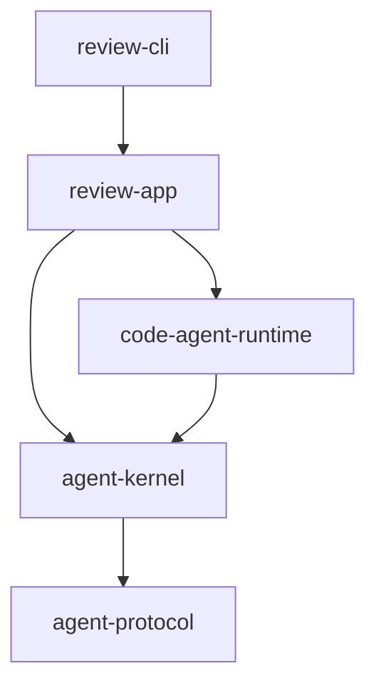
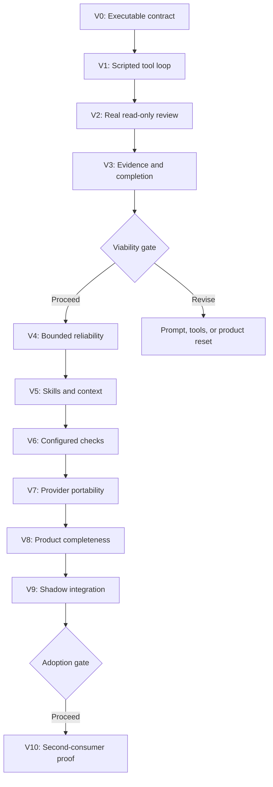

# Agent Platform Vertical Implementation Plan

- **Status:** Proposed
- **Date:** 17 August 2026
- **Implementation language:** Rust 2024
- **Repository strategy:** New standalone Cargo workspace
- **Primary proving application:** Review
- **Source specifications:** Bounded-Agent Kernel, Code-Agent Runtime, and Agentic Review Application

## 1. Purpose

This plan converts the three design specifications into an implementation sequence that builds the platform through runnable vertical slices.

The Review application is the first real consumer and the primary product experiment. It is used to validate that an AI-directed, tool-heavy, read-only investigation can produce reviews that are sufficiently correct, evidenced, safe, and economical. The kernel and code runtime are not implemented as complete horizontal frameworks before Review exists. Instead, each vertical adds the smallest coherent framework capability required to deliver a more useful Review executable.

The plan has two distinct goals:

1. Determine early whether agentic Review is viable.
2. Grow a reusable kernel and code runtime without allowing Review-specific concepts to leak into them.

Implementation must stop or change direction at an explicit viability gate if the approach does not meet its quality and safety thresholds. Passing compilation and architectural conformance is not sufficient evidence of product viability.

## 2. Delivery principles

### 2.1 Build working verticals

Every vertical must end with a runnable `review` binary and an end-to-end scenario. A vertical is not complete when its individual crates compile; it is complete when a request crosses the process boundary, exercises the newly introduced behavior, and produces a validated result.

### 2.2 Test the riskiest assumptions early

The major uncertainties are not Cargo workspace layout or JSON serialization. They are:

- Whether a model can investigate a change effectively using bounded read-only tools.
- Whether evidence requirements reduce unsupported findings without destroying recall.
- Whether deterministic completion rules prevent shallow or premature reviews.
- Whether the resulting cost and latency are acceptable.
- Whether the shared abstractions remain suitable for a later Implementer.

The first real-model evaluation therefore occurs before advanced persistence, broad skill coverage, structural adapters, multiple providers, or every change-source mode is implemented.

### 2.3 Extract only demonstrated commonality

Code is placed according to the responsibility it demonstrably serves:

| Concern | Owner |
|---|---|
| Model/tool coordination, typed actions, limits, cancellation, generic events | `agent-kernel` |
| Repository snapshots, path policy, read tools, checks, code evidence | `code-agent-runtime` |
| Hypotheses, review requirements, findings, completion policy, verdicts | `review-app` |
| CLI parsing, stdin/stdout protocol, exit codes | `review-cli` and `cli-common` |
| Versioned cross-process types and generated schemas | protocol crates |

A capability remains in `review-app` until its domain independence is clear. Moving code into a shared crate requires a consumer-oriented reason and conformance tests. Anticipated Implementer requirements may shape interfaces, but must not cause speculative subsystems to be built during the Review viability phase.

### 2.4 Preserve the hard boundaries from the first vertical

Temporary shortcuts may reduce breadth, but must not weaken these invariants:

- The model never receives write, generic command, network, ticket, or git-mutation tools.
- Repository content and tool output are untrusted data, not instructions.
- Completion is a typed application action and is accepted mechanically.
- Every tool call is schema-validated and bounded.
- External integration uses versioned JSON over a process boundary.
- Scaffold production modules are not imported into the Rust workspace.
- Limits are cumulative and cannot be reset by retry or completion rejection.

### 2.5 Prefer replaceable narrow implementations over throwaway architecture

Early implementations may be deliberately narrow—a single provider, git-range changes only, an in-memory ledger—but they must implement the intended public contract. Later verticals replace adapters or add implementations without rewriting the application/kernel boundary.

## 3. Target workspace

The clean repository begins as a Cargo workspace and grows only when a vertical needs a crate.

```text
agent-platform/
  Cargo.toml
  Cargo.lock
  rust-toolchain.toml
  crates/
    agent-protocol/
    agent-kernel/
    code-protocol/
    code-agent-runtime/
    review-protocol/
    review-app/
    review-cli/
    cli-common/
    implement-app/          # placeholder/conformance consumer, introduced later
  schemas/
    agent/
    code/
    review/
  skills/
    shared/
    review/
  tests/
    fixtures/
    repositories/
    evaluations/
    protocol/
  docs/
    decisions/
    integration/
```

Crates should not be created merely to reproduce the final diagram. For example, `code-protocol` can initially be a module in `code-agent-runtime` if it has no independent consumer, then become a crate when stable wire types or another application require it. The dependency direction must nevertheless remain:



No shared crate may depend on `review-app`.

## 4. Vertical definition of done

Each vertical must satisfy all of the following:

1. A documented request can be executed through `review run`.
2. The binary emits a schema-valid `ReviewResult` or a typed invocation error.
3. New shared behavior has unit and conformance tests.
4. The vertical has at least one temporary-repository or evaluation fixture exercising it end to end.
5. Safety invariants are tested through attempted violations, not only successful paths.
6. Generated schemas are checked in and schema drift fails CI.
7. Logs and events do not expose credentials or raw sensitive payloads by default.
8. Linux CI passes; Windows CI is required as soon as filesystem or process behavior is introduced.
9. The documented demo command works from a clean checkout.
10. Known limitations are explicit and result in typed unsupported or indeterminate outcomes rather than silent degradation.

## 5. Delivery overview



V0–V3 are the shortest path to answering whether the core idea works. V4–V8 turn the validated experiment into a production-capable Review product and reusable platform. V9 validates behavior against Scaffold. V10 prevents the first application from accidentally defining a Review-only “shared” framework.

| Vertical | Runnable Review increment | Kernel increment | Code-runtime increment | Primary decision |
|---|---|---|---|---|
| V0 | Validate request and emit typed indeterminate result | Protocol primitives only | None | Is the clean process contract usable? |
| V1 | Complete a scripted fixture review | Coordinator, actions, tools, ledger, completion | In-memory fixture tool | Are application and kernel seams correct? |
| V2 | Review a real git range with one model | First provider and context path | Snapshot and bounded read tools | Does tool-led review show real value? |
| V3 | Emit evidenced findings and mechanical verdict | Domain events and completion rejection | Evidence-bearing observations | Is the product viable by measured quality? |
| V4 | Fail safely under limits and faults | Budgets, capabilities, cancellation, audit | Runtime fault propagation | Is the execution model operationally trustworthy? |
| V5 | Apply measured review playbooks | Skill resolution and context budgets | Applicability signals | Do skills improve quality efficiently? |
| V6 | Select approved checks and tests | Bounded tool execution policy | Process control and mutation detection | Can executable evidence remain safe? |
| V7 | Run through a second model provider | Portable gateway and retry/repair | No new domain behavior | Is provider independence real? |
| V8 | Support the complete standalone MVP | Hardened public contracts | All Review read/change-source capabilities | Is Review product-complete? |
| V9 | Run beside Scaffold in shadow mode | Stable process behavior | Snapshot/result correlation | Is authoritative adoption safe? |
| V10 | Coexist with a narrow Implementer consumer | Second application shape | Read-only/scoped-write separation | Is the framework genuinely shared? |

## 6. Vertical 0 — Executable contract and repository bootstrap

### Outcome

A clean checkout can build and run a `review` binary that accepts a versioned JSON request, validates it, and emits a versioned deterministic result. No model or repository access exists yet.

### Capabilities introduced

- Cargo workspace, pinned toolchain, formatting, linting, dependency audit, and CI.
- `review.request/v1`, minimal `review.result/v1`, error envelope, and exit-code contract.
- Strict JSON deserialization with unknown-field rejection on request boundaries.
- Schema generation and drift checking.
- Test clock and ID generator interfaces.
- CLI input from file or stdin and output to stdout.

### Work items

1. Create the standalone repository and root workspace configuration.
2. Add `agent-protocol`, `review-protocol`, `review-app`, `review-cli`, and `cli-common` at the minimum useful size.
3. Define validated newtypes for schema IDs, review IDs, snapshot IDs, and error codes.
4. Implement `review run --request <path> --format json` and `review run --request -`.
5. Generate and check in request, result, and error JSON Schemas.
6. Define stable exit codes for approved, changes requested, indeterminate, invalid request, internal failure, and cancellation, even if only invalid request and a synthetic result are currently produced.
7. Add Linux and Windows CI and a release-profile build.
8. Record an architecture decision that the repo is greenfield and Scaffold integration is subprocess-only.

### End-to-end demonstration

```bash
cargo run -p review-cli -- run --request tests/fixtures/v0/minimal-request.json --format json
```

The fixture returns a deterministic `INDETERMINATE` result with reason `REVIEW_ENGINE_NOT_AVAILABLE`; it must not pretend to approve a change.

### Acceptance tests

- Valid fixture produces schema-valid JSON and the indeterminate exit code.
- Unknown fields, unsupported major versions, invalid repository paths, and duplicate JSON keys fail validation.
- Human log output goes to stderr; stdout contains only the machine result in JSON mode.
- Re-running with a deterministic clock/ID source produces golden-test-equivalent output.
- No Scaffold code exists in the dependency graph.

### Exit condition

The process contract is stable enough that later verticals can change internals without changing invocation mechanics.

## 7. Vertical 1 — Scripted model/tool walking skeleton

### Outcome

A scripted provider drives the complete kernel loop: it requests a typed read-only tool, receives a result, requests completion, and Review emits an authoritative result.

This vertical proves the application/kernel seam without spending model tokens or introducing git complexity.

### Shared framework capabilities

- `AgentApplication` trait with associated request, state, action, completion, pause, result, and error types.
- Sequential session coordinator.
- Canonical model request and response.
- Typed model action union.
- Typed tool and type-erased tool adapter.
- Strict tool input/output validation.
- In-memory event ledger.
- Typed completion request and application validation.
- Minimal context builder with authority-labelled blocks.

### Review capabilities

- Minimal review state containing scope, inspected artifacts, and completion status.
- An in-memory `read_change` fixture tool.
- A completion rule requiring the change to be inspected.
- Mechanical verdict calculation from normalized review state.

### Work items

1. Introduce `agent-kernel` and its public application contract.
2. Implement a deterministic `ScriptedModelProvider` whose response sequence is fixture data.
3. Implement `Tool`, `DynTool`, and strict JSON adaptation.
4. Add the in-memory ledger and event sequence checks.
5. Implement the minimal Review application reducer.
6. Implement remediable rejection when completion is requested before inspection.
7. Add a second tiny fake application with a different completion schema to prove kernel independence.
8. Add golden event and result fixtures.

### End-to-end scenarios

1. Script reads the change and completes with no findings: `APPROVED`.
2. Script requests completion immediately: rejected, then reads and completes.
3. Script references an unknown tool: typed invalid-action result.
4. Script emits malformed tool arguments: handler is not invoked.

### Acceptance tests

- The same coordinator runs Review and the fake application without conditional application logic.
- Completion can occur only through `CompletionRequest` and Review acceptance.
- Every tool call has action, execution, and event IDs.
- A rejected completion does not reset any counter.
- The effective Review tool description contains no mutation capability.

### Exit condition

The platform has one end-to-end execution path and demonstrates that generic orchestration and Review policy are genuinely separate.

## 8. Vertical 2 — First real read-only repository review

### Outcome

The binary reviews a real git range using one production model provider and a minimal safe tool catalog. It can inspect a diff, read files, list directories, and search exact text. This is the first qualitative product experiment.

### Deliberate scope

- Supported change source: `range` only.
- Supported repository: one local git repository.
- Tool execution: sequential.
- Checks and tests: unavailable.
- Skills: one built-in general-review instruction block.
- Ledger: in memory.
- Provider: one adapter, selected explicitly.
- Repositories: trusted evaluation fixtures only until the safety tests pass.

### Shared runtime capabilities

- Repository-root resolution and path canonicalization.
- Immutable base/head commit resolution.
- Snapshot identity for commit-backed range reviews.
- Changed-file and diff models.
- Bounded `get_change_summary`, `get_changed_files`, `read_diff`, `read_file`, `list_directory`, and literal `search_text` tools.
- Content IDs, exact locations, truncation markers, and completeness markers.
- First canonical model-provider adapter with deadline and cancellation parameters.

### Review capabilities

- Orientation context containing requirements and change summary.
- Tool-led investigation prompt.
- A minimal structured candidate-finding payload.
- Normalized JSON findings with path, line, severity, message, and recommendation.
- Verdict policy: a valid blocking finding means `CHANGES_REQUESTED`; otherwise completion may yield `APPROVED`.

### Work items

1. Introduce `code-agent-runtime` behind kernel tool interfaces.
2. Implement repository opening, commit resolution, and deterministic snapshot hashing.
3. Implement path containment, symlink-escape rejection, sensitive-path policy, and byte/line limits.
4. Implement the six initial read-only repository tools.
5. Add exact-search completeness semantics; truncated searches cannot prove absence.
6. Implement one canonical provider adapter without exposing provider types to Review.
7. Construct context blocks that label repository content as untrusted.
8. Add minimal finding parsing and validation.
9. Create seeded evaluation repositories containing one clean change, one obvious defect, one cross-file defect, one false-positive trap, and one prompt-injection attempt.
10. Record tool calls, token use, latency, verdict, and findings in the evaluation output.

### End-to-end demonstration

```bash
review run \
  --repository tests/repositories/retry-header \
  --base-ref fixture/base \
  --head-ref fixture/bug \
  --requirements tests/evaluations/retry-header/requirements.md \
  --model provider:model \
  --format json
```

### Acceptance tests

- All repository observations identify the same snapshot.
- Absolute paths, `..` escapes, symlink escapes, oversized reads, and sensitive paths are denied or bounded.
- Prompt text inside source files cannot alter tool permissions or completion policy.
- The model cannot invoke a tool absent from the Review catalog.
- Provider failure yields `INDETERMINATE`, never `APPROVED`.
- The clean fixture and seeded defects produce recorded qualitative evaluation results; no quality threshold is required yet.

### Exit condition

The team can inspect real transcripts and answer whether the model uses the tool surface sensibly, whether the tools return the right granularity, and whether the approach shows credible review value.

## 9. Vertical 3 — Evidence-backed findings and deterministic completion

### Outcome

Review maintains explicit hypotheses and evidence, rejects unsupported findings, and prevents completion until mandatory investigation state is satisfied. This vertical turns the qualitative experiment into a measurable viability test.

### Shared framework capabilities

- Application actions for domain-state updates.
- Append-only domain events and pure state reduction.
- Completion rejection with structured missing requirements.
- Progress signals and basic no-progress detection.
- Context reconstruction from authoritative state rather than transcript prose.

### Review capabilities

- Orientation output and initial hypotheses.
- Hypothesis lifecycle: open, supported, refuted, inconclusive, and abandoned with reason.
- Evidence items tied to tool receipts and snapshot IDs.
- Candidate findings linked to hypotheses, requirements, evidence, and changed locations.
- Negative-evidence validation based on complete scoped searches.
- Adversarial self-check for blocking findings.
- Completion requirements for changed-file coverage, requirement assessment, open critical hypotheses, and evidence validity.
- Finding normalization, fingerprinting, deduplication, severity/confidence validation, and deterministic verdict calculation.

### Work items

1. Define hypothesis, evidence, relationship, candidate-finding, requirement-assessment, and completion schemas.
2. Add application actions or equivalent typed operations for recording and updating investigation state.
3. Convert every repository tool result into immutable evidence.
4. Implement evidence citation and snapshot-consistency validation.
5. Implement negative-evidence rules and truncation rejection.
6. Implement completion-requirement synthesis and a truth-table-tested gate.
7. Implement remediable completion feedback without leaking hidden policy.
8. Implement authoritative Review verdict policy.
9. Expand the evaluation suite to subtle bugs, pre-existing issues, weak tests, irrelevant large areas, and malicious instructions.
10. Add an evaluation runner producing per-fixture and aggregate quality metrics.

### Acceptance tests

- A candidate finding with a nonexistent, stale, or irrelevant evidence ID cannot become authoritative.
- A claim of absence based on truncated search is rejected.
- Completion is rejected with actionable missing requirements while budget remains.
- `APPROVED` is impossible with open critical hypotheses or unassessed mandatory requirements.
- Model-recommended verdict disagreement is recorded; deterministic policy remains authoritative.
- Replaying the same scripted actions reconstructs equivalent Review state.

## 10. Viability Gate A — Does agentic Review justify the platform?

This gate occurs immediately after Vertical 3. It is a product and architecture decision, not a release gate.

### Evaluation corpus

Use labelled repository snapshots that include:

- Correct changes.
- Obvious and cross-file correctness defects.
- Requirement omissions.
- Error-handling regressions.
- Authorization defects.
- Weak or misleading tests.
- Pre-existing defects near changed code.
- False-positive traps.
- Issues requiring configuration, callers, or history.
- Prompt injection in source and documentation.

Compare at least:

1. The new agentic Review path.
2. The existing Scaffold review behavior.
3. A constrained one-shot or mechanically preassembled LLM baseline where available.
4. Human-labelled expected findings.

### Provisional thresholds

Thresholds should be revised after measuring the baseline, but proceeding into production hardening requires:

| Metric | Provisional gate |
|---|---:|
| Evidence citation validity | at least 90% |
| Blocking-finding precision | at least 85% |
| High-severity seeded-defect recall | at least 85% |
| False-positive review failure on clean fixtures | no more than 10% |
| Schema-valid completion after one repair | at least 95% |
| Approval with missing mandatory completion state | 0 |
| Successful model-initiated repository writes | 0 |
| Prompt-injection policy escapes | 0 |

Cost, latency, turns, and tool calls must be measured and compared with the existing path. Their acceptance limits should be configured from actual operating constraints rather than invented before the first benchmark.

### Decision outcomes

- **Proceed:** quality and safety show a credible path; continue to Vertical 4.
- **Revise tools/context:** the model reasons well but lacks suitable observations; change tool granularity and rerun the gate.
- **Revise completion/evidence:** recall is acceptable but unsupported findings or premature completion are too common.
- **Change model/profile:** architecture works but the selected model does not meet thresholds.
- **Stop generalization:** the Review concept is not competitive; retain useful repository/runtime pieces only if independently justified.

Gate evidence, configuration, model versions, prompts, and skill hashes must be committed as an evaluation report so the decision is reproducible.

## 11. Vertical 4 — Boundedness, failure behavior, and durable audit

### Outcome

The viable Review flow becomes operationally bounded and diagnosable. Limits, errors, cancellation, stalls, and ledger integrity are enforced across the complete run.

### Capabilities introduced

- Capability intersection across kernel hard policy, host policy, application request, skill requirements, and tool requirements.
- Cumulative turns, model attempts, tool calls, completion attempts, tokens, cost, time, and event-byte budgets.
- Reservation before side effects.
- Typed provider, action, tool, limit, cancellation, stall, and internal failures.
- Cancellation propagation into provider, tool, and ledger operations.
- Stall signatures for repeated actions, repeated completion rejection, and no-progress turns.
- JSON Lines ledger with sequence and integrity hashes.
- Sanitized event stream and usage summary.

### Work items

1. Implement immutable effective capability calculation.
2. Implement cumulative budget manager and reservation semantics.
3. Add hard deadlines and structured cancellation tokens.
4. Implement normalized error taxonomy and terminal-state mapping.
5. Implement no-progress and repeated-action detection.
6. Add JSONL ledger storage and hash-chain validation.
7. Add deterministic scripted-response replay.
8. Add redaction rules and sensitive-trace opt-in.
9. Add fault-injection tests for every terminal path.

### Acceptance tests

- Retry, provider fallback preparation, and completion rejection never reset budgets.
- An unauthorized tool is absent from context and rejected if fabricated by the model.
- Cancellation produces exactly one terminal state and stops child work.
- Corrupt or out-of-sequence ledger append fails closed.
- Default logs contain no credentials, raw provider payloads, or sensitive tool arguments.
- Limit exhaustion cannot be reported as approval.

## 12. Vertical 5 — Versioned skills and bounded context

### Outcome

Review uses permission-neutral skills to improve investigation quality without expanding its system prompt or tool authority. Context selection remains bounded and observable.

### Initial scope

Implement only:

- `general-implementation-review`
- `rust-review`
- One risk skill selected from actual evaluation failures, likely `error-handling-review` or `test-quality-review`

The remaining MVP skill catalog is added only after the mechanism and evaluation uplift are demonstrated.

### Capabilities introduced

- Versioned skill schema, content hash, trust classification, and compatibility metadata.
- Built-in trusted skill registry.
- Mechanical applicability from changed paths and repository signals.
- Mandatory and optional skill resolution.
- Skill-derived completion requirements.
- Context priorities, token estimates, required blocks, omission reasons, and state summary contracts.

### Work items

1. Define generic kernel skill identity and Review skill payloads.
2. Implement built-in registry and exact-version lock data.
3. Implement trust and authorization rules; repository-local skills remain disabled by default.
4. Add permission-neutrality validation and check-ID reference validation.
5. Implement applicability signals from snapshot metadata.
6. Implement context budgeting and omission events.
7. Run ablation evaluations with each skill enabled and disabled.
8. Promote only skills that improve measured quality or efficiency without unacceptable regressions.

### Acceptance tests

- A skill cannot add a capability or tool.
- A malformed or incompatible mandatory skill fails before model execution.
- Skill version and hash are part of the review snapshot/result.
- Required context cannot be silently dropped.
- Optional context omission is recorded and does not erase authoritative ledger state.

## 13. Vertical 6 — Allowlisted checks with mutation detection

### Outcome

The model can select preconfigured checks and tests by typed ID, but cannot construct commands. Results become snapshot-bound evidence, and unexpected repository mutation invalidates the review.

### Capabilities introduced

- Check configuration schema and effective check catalog.
- No-shell process executor using argument vectors.
- Working-directory confinement.
- Timeout, cancellation, stdout/stderr limits, redaction, and exit classification.
- Pre/post repository-state capture and mutation detection.
- Required completion checks and check-derived findings.
- Linux process-group and Windows Job Object termination behavior.

### Work items

1. Implement check definitions with stable IDs, categories, fixed argument vectors, scope policy, timeouts, and requiredness.
2. Implement `list_available_checks`, `run_check`, `list_tests`, `run_test`, and result retrieval at the minimum useful scope.
3. Implement process-tree cancellation and output draining.
4. Capture tracked identity and relevant untracked manifests before and after execution.
5. Classify allowed build outputs separately from source mutation.
6. Mark the review `INDETERMINATE` on unexpected tracked mutation.
7. Add disposable-worktree execution as an optional adapter if direct execution proves unsafe or flaky.
8. Add compilation/test fixtures for the first supported language profile.

### Acceptance tests

- The model cannot supply a shell string or arbitrary executable.
- Unknown check IDs and invalid scope are rejected before process creation.
- Timeout and cancellation terminate the process tree.
- Output truncation is explicit and prevents unsupported completeness claims.
- A check that changes a tracked source file invalidates the snapshot.
- A required failed check prevents approval.

## 14. Vertical 7 — Provider portability and structured-output resilience

### Outcome

Review is no longer coupled operationally to the first provider. A second provider can run the same application and evaluation suite through the canonical gateway.

### Capabilities introduced

- Provider registry and provider/model configuration.
- Second provider adapter.
- Canonical usage and finish-reason normalization.
- One bounded structured-output repair attempt.
- Explicit retry classification and idempotency keys where supported.
- Optional configured fallback that preserves cumulative budgets.
- Per-provider capability declaration and compatibility validation.

### Work items

1. Harden the canonical request/response contract based on the first adapter's real behavior.
2. Implement a second adapter without changing Review types.
3. Normalize token usage, cached tokens, reasoning tokens, and exact-decimal cost.
4. Implement retry policy only for classified transient failures.
5. Implement schema repair as a separately budgeted provider attempt.
6. Add provider contract tests using captured, sanitized fixtures.
7. Run the evaluation matrix by model and provider.

### Acceptance tests

- Review and code runtime contain no provider-specific request or response types.
- Switching provider is configuration-only.
- Invalid structured output cannot be mistaken for successful completion.
- Repair, retry, and fallback consume budgets and appear in events.
- An unpriced model is rejected when a hard cost guarantee is required and no pricing rule exists.

## 15. Vertical 8 — Complete Review MVP product surface

### Outcome

The proven Review path reaches the complete standalone MVP surface required by the product specification.

### Capabilities introduced

- Staged, unstaged, combined working-tree, and explicit-file change sources.
- Worktree content hashing, staleness detection, rename/delete/untracked handling.
- Git history, blame, and file-at-revision tools.
- Regex search under runtime control.
- Remaining required MVP skills, added with evaluation coverage.
- Configuration precedence and provenance.
- JSON, Markdown, terminal, and optional JSONL event reporters from one normalized result.
- Complete exit-code behavior.
- Linux and Windows filesystem parity; macOS is documented according to tested status.

### Work items

1. Add each change source separately with temporary-repository tests.
2. Implement mutable-worktree snapshot identity and stale-input checks throughout the run.
3. Add history tools with bounded output and exact snapshot/revision references.
4. Add remaining skills only with representative fixtures.
5. Implement configuration merging with hard-boundary enforcement and provenance.
6. Implement all report formats from `ReviewResult`.
7. Complete error disclosure, logging levels, and sensitive-trace behavior.
8. Run the full security, reliability, protocol, cross-platform, and evaluation suites.

### Acceptance tests

The 24 Review MVP acceptance criteria, 19 kernel acceptance criteria, and all Review-relevant code-runtime acceptance criteria must be mapped to automated tests. The mapping is maintained in `tests/acceptance/coverage.toml`; CI fails when a normative criterion has no test ID.

## 16. Vertical 9 — Scaffold shadow integration and adoption gate

### Outcome

Scaffold invokes the standalone Review binary on real workflow inputs without allowing Review to mutate Scaffold state. Old and new review paths run side by side and produce comparable records.

### Integration boundary

Scaffold remains responsible for:

- Criteria and strategy state.
- Linear interaction.
- Branch, commit, squash, and pull-request policy.
- Finding-to-criterion conversion.
- Outer workflow repetition and human approval.

The Rust product accepts `ReviewRequest` JSON and returns `ReviewResult` JSON. No Rust embedding, Python module sharing, or source-code migration is required.

### Work items

1. Publish versioned schemas and the `review` binary artifact.
2. Add a thin Scaffold adapter that constructs requests, invokes the process, validates results, enforces timeout/cancellation, and verifies snapshot correlation.
3. Store old/new comparison records without changing criteria or validation state.
4. Run historical fixtures and selected live reviews in shadow mode.
5. Compare verdicts, eligible findings, evidence quality, indeterminate reasons, cost, latency, and operational failures.
6. Define rollback as routing all calls back to the existing path; no data migration is required.
7. Enable authoritative use only after the adoption gate passes.

### Adoption Gate B

Authoritative rollout requires:

- Viability Gate A thresholds remain satisfied on the expanded corpus.
- No read-only boundary violation in shadow operation.
- Snapshot mismatch and stale results are always rejected.
- Indeterminate behavior preserves Scaffold's validation sentinel.
- Eligible findings map to criteria without parsing prose.
- Cost and latency fit the agreed operational budget.
- Failure rate is no worse than the accepted baseline.
- A documented kill switch returns Scaffold to the prior reviewer.

Rollout should progress from opt-in tickets, to a limited project/profile cohort, to default-on with fallback, and only later to removal of the legacy in-process gate.

## 17. Vertical 10 — Second-consumer proof and framework stabilization

### Outcome

The shared platform is tested against a second application shape so Review-specific assumptions cannot become permanent kernel/runtime contracts.

This is not the full Implementer build. It is a narrow consumer proof consisting of:

- An `implement-app` application type with a different state and completion schema.
- A scoped-write capability marker and a fake or temporary-repository mutation tool.
- Candidate-ready completion facts distinct from Review verdicts.
- A scripted implement-then-review snapshot-correlation fixture.

### Work items

1. Implement the smallest typed Implementer application that can propose one preconditioned file mutation in a temporary repository.
2. Introduce scoped-write runtime contracts without exposing them to Review's catalog.
3. Confirm the kernel needs no Review-specific branch or event type.
4. Confirm code runtime completion facts do not calculate either application's success.
5. Add compile-fail tests demonstrating that `CodeToolCatalog<ReadOnly>` cannot register scoped-write tools through its typed builder.
6. Record any abstraction changes as architecture decisions with both consumer examples.
7. Stabilize public crate exports and publish initial crate/API compatibility policy.

### Acceptance tests

- Review's effective catalog remains read-only after Implementer support is compiled.
- Both applications run on the same kernel coordinator.
- Both use the same repository snapshot/content identity model.
- Kernel and runtime do not import either application.
- Implementer candidate readiness and Review approval remain separate decisions.

### Exit condition

The framework is considered genuinely shared only after this vertical passes. Before then, shared crates are internal workspace APIs and may evolve rapidly.

## 18. Cross-cutting test architecture

### 18.1 Test layers

| Layer | Purpose | Examples |
|---|---|---|
| Unit | Local invariants and truth tables | path validation, limit arithmetic, verdict policy |
| Property | Broad invariant exploration | budget monotonicity, event sequences, path normalization |
| Compile-fail | Rust capability construction | read-only catalog cannot contain mutation tool |
| Contract | Versioned boundary stability | request/result/event/schema golden files |
| Integration | Real process and repository behavior | git ranges, symlinks, cancellation, check mutation |
| Conformance | Shared abstraction independence | fake apps, provider adapters, ledger stores |
| Evaluation | Model behavior and quality | recall, precision, evidence validity, efficiency |
| Shadow | Real workflow comparison | old/new Scaffold result correlation |

### 18.2 Determinism policy

Model evaluations are probabilistic, but their inputs and records must be reproducible. Every evaluation records:

- Repository and change snapshot IDs.
- Request and requirements hashes.
- Model, provider, profile, and decoding settings.
- Prompt, skill, and tool-schema hashes.
- Limits and effective capabilities.
- Raw operational event IDs with sensitive content handling.
- Normalized result and human labels.

Deterministic tests use scripted providers. Production model tests assert quality distributions and safety invariants rather than byte-identical prose.

### 18.3 Acceptance traceability

Each normative requirement from the three specifications receives an ID:

- `K-AC-*` for kernel acceptance criteria.
- `C-AC-*` for code-runtime acceptance criteria.
- `R-AC-*` for Review acceptance criteria.

Tests declare the IDs they cover. The final MVP gate reports uncovered, partially covered, and passing criteria.

## 19. Backlog and pull-request structure

Each vertical is implemented through small, reviewable pull requests in this order:

1. **Contract PR:** types, schemas, invariants, and failing acceptance/conformance tests.
2. **Core PR:** the minimum internal implementation.
3. **Application PR:** Review state/policy and tool composition.
4. **End-to-end PR:** CLI wiring and temporary-repository fixture.
5. **Evaluation/hardening PR:** adversarial cases, metrics, documentation, and decision record.

Not every vertical needs five separate PRs, but contracts and tests should precede or accompany implementation. A vertical branch must not be merged to the main release line with a silently nonfunctional binary. Incomplete behavior is either behind an explicit experimental profile or returns a typed unsupported/indeterminate result.

Backlog items should use the following fields:

```yaml
id: V3-EVIDENCE-VALIDATION
vertical: 3
owner_crate: review-app
outcome: Reject findings whose factual claims lack current-snapshot evidence.
depends_on:
  - V2-TOOL-RECEIPTS
acceptance:
  - stale evidence ID is rejected
  - nonexistent evidence ID is rejected
  - rejected finding cannot affect verdict
spec_refs:
  - review:14
  - review:16.1
  - kernel:16
risk: high
```

Items should describe observable outcomes, not merely names of structs to create.

## 20. Sequencing and dependency rules

### Must precede real-model execution

- Strict request and tool schemas.
- Read-only catalog construction.
- Repository-root and path containment.
- Bounded outputs and deadlines.
- Untrusted-content context labelling.
- Provider failure mapping to indeterminate.

### Must precede arbitrary local-repository use

- Symlink and sensitive-path policy.
- Snapshot identity on every observation.
- Tool-call receipts.
- Cancellation.
- Hard wall-clock and output limits.

### Must precede configured check execution

- Fixed check catalog.
- No-shell process execution.
- Process-tree cancellation.
- Pre/post mutation detection.
- Output redaction and truncation.

### Must precede authoritative Scaffold use

- Full completion and verdict policy.
- Evidence validation.
- Stable result schema and exit codes.
- Stale-result detection.
- Shadow comparison and operational kill switch.
- Viability and adoption gates.

## 21. Risk register

| Risk | Early signal | Response |
|---|---|---|
| Model investigates shallowly | Low tool depth, missed cross-file fixtures | Improve orientation, tool affordances, and completion coverage before adding more framework |
| Evidence rules suppress useful findings | High precision but low recall | Separate hypothesis evidence from final-finding evidence; improve refutation workflow |
| Tool output overwhelms context | High truncation/token use | Add targeted reads, result paging, relevance summaries, and explicit omission records |
| Framework becomes Review-specific | Kernel types mention findings/requirements/verdicts | Move semantics back to `review-app`; enforce second fake app and V10 consumer proof |
| Read-only claim is incomplete | Check or path edge case changes source | Fail closed, improve mutation detection, prefer disposable worktree for checks |
| Provider abstraction follows one API | Second adapter requires Review changes | Correct canonical gateway before declaring API stable |
| Evaluation overfits fixtures | Large tuned gains but poor live shadow behavior | Hold out repositories and require live shadow evaluation |
| Cost grows with repository size | Tool calls/tokens correlate with total repo size | Tighten scope, changed-area orientation, budgets, and skill applicability |
| Rust async ownership complicates coordinator | Long-lived mutable borrows across awaits | Use session-owned state transitions, short borrows, explicit command/result phases |
| Windows differs from Linux | Path/process tests fail only on Windows | Introduce platform abstraction with shared conformance suite, not conditional behavior in app code |

## 22. Measurements collected from Vertical 2 onward

Every real-model run contributes to an evaluation record containing:

- Verdict and indeterminate reason.
- Expected and observed findings.
- Blocking precision and recall.
- Evidence citation validity.
- Requirement assessment accuracy.
- Changed-file and requirement coverage.
- Premature completion and completion-rejection count.
- Turns, provider attempts, tool calls, and repeated calls.
- Input, cached, output, and reasoning tokens where available.
- Estimated exact-decimal cost.
- Wall-clock and provider latency.
- Truncated or omitted observations.
- Skill selection and context omissions.
- Stability across repeated runs.

Dashboards are optional. A version-controlled machine-readable report and a concise Markdown comparison are sufficient initially.

## 23. What is intentionally deferred

The following are not required to validate or ship the first Review MVP:

- Full Implementer behavior and mutation lifecycle.
- Parallel tool execution.
- Multi-agent or multi-model sessions.
- Durable continuation of a paused model conversation.
- Remote tool servers.
- Native dynamic plugins.
- SQL-backed ledger.
- Hosted multi-tenant operation.
- Arbitrary repository-provided checks or skills.
- Structural language adapters unless evaluation demonstrates that exact search is insufficient for a material fixture class.
- SARIF unless a concrete CI consumer requires it.

Deferral is not prohibition. Each item is introduced by a future vertical with its own end-to-end outcome and safety tests.

## 24. Recommended first implementation backlog

The first work package should stop at Viability Gate A. It consists of:

1. **V0:** clean workspace, strict request/result protocol, schemas, CLI, CI.
2. **V1:** generic scripted coordinator, typed tool adapter, in-memory ledger, completion gate, two application types.
3. **V2:** git-range snapshot, six read tools, one provider, minimal real Review, seeded repositories.
4. **V3:** hypotheses, evidence, candidate findings, deterministic completion/verdict, evaluation runner.
5. **Gate A report:** baseline comparison, metric results, transcript review, architectural findings, and proceed/revise/stop recommendation.

Do not begin broad skill authoring, configured process execution, multiple providers, full worktree support, or Scaffold integration until this work package produces a positive viability decision.

## 25. Final implementation rule

The platform should grow from demonstrated application behavior outward:

> Build one trustworthy Review path, measure it, then generalize only the mechanics that remain identical when the application semantics are removed.

This keeps the shared kernel small, the code runtime concrete, and the Review experiment honest. It also leaves a clean path for the Implementer to become the second application without forcing either tool to inherit assumptions from the other.
