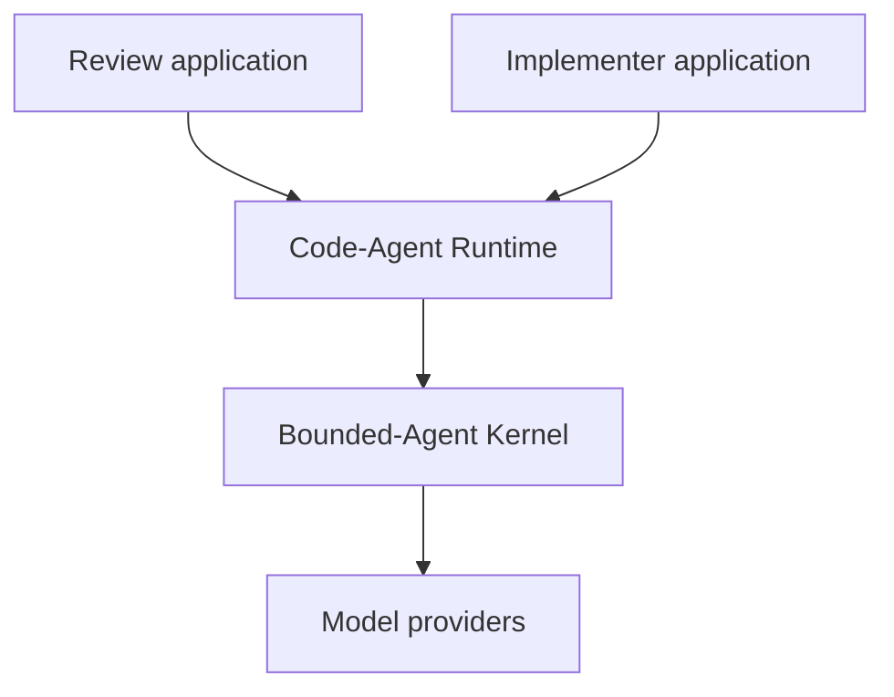
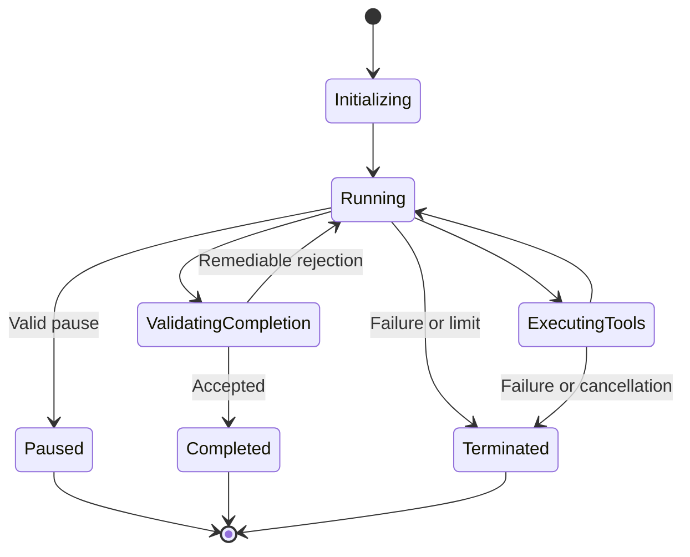

# Detailed Design Specification: Bounded-Agent Kernel

- **Working package name:** `agent_runtime`
- **Status:** Proposed
- **Date:** 16 August 2026
- **Initial implementation language:** Python 3.11+
- **Primary consumers:** Code-Agent Runtime, Review, Implementer
- **Primary interface:** In-process Python API with versioned event and data schemas
- **Companion specification:** `code-agent-runtime-design-spec.md`

## 1. Executive summary

The Bounded-Agent Kernel is a repository- and domain-independent execution engine for tool-using AI applications. It provides a controlled model/tool loop, typed capability enforcement, skill loading, resource budgets, append-only event recording, structured completion, cancellation, retry handling, and observability.

The kernel does not know what code review, code generation, git, files, tests, findings, or implementation success mean. Applications provide those semantics through explicit extension contracts.

The kernel's central responsibility is:

> Execute an adaptive AI-directed workflow without allowing the model to escape declared capabilities, reset limits, silently complete, or bypass application policy.

Review and Implementer share the same orchestration mechanics but remain separate applications:

- Review exposes read-only code tools and validates review completion.
- Implementer exposes scoped mutation tools and validates candidate readiness.
- The Code-Agent Runtime supplies shared repository capabilities to both.
- The kernel supplies only domain-neutral execution mechanics.

## 2. Architectural position



Dependency direction is strictly downward. The kernel must not import from the Code-Agent Runtime, Review, Implementer, Scaffold, Pi, Linear, or any application package.

The kernel is initially an internal package in the same repository or monorepo as its consumers. Independent versioning should wait until its interfaces are exercised by both Review and Implementer.

## 3. Goals

### 3.1 MVP goals

- Run a bounded AI/tool interaction loop.
- Support multiple model providers behind one canonical adapter.
- Expose only application-authorized typed tools.
- Validate every tool input and output.
- Enforce capabilities outside the model.
- Load trusted, versioned skills without allowing them to grant permissions.
- Maintain an append-only session ledger.
- Support application-defined state reduction and completion validation.
- Enforce cumulative turn, tool, token, cost, retry, and wall-clock limits.
- Detect stalled loops and repeated calls.
- Provide structured cancellation and failure semantics.
- Emit versioned events and canonical usage data.
- Make application results independent of raw provider response formats.
- Be deterministic outside model invocation and explicitly record nondeterminism.

### 3.2 Later goals

- Durable crash recovery and safe session resumption.
- Multiple cooperating model roles within one bounded session.
- Parallel read-only tool scheduling.
- Remote tool transports.
- Pluggable ledger stores.
- Deterministic model-response replay for debugging.
- Policy-signed skill catalogs.
- Distributed tracing integration.

## 4. Non-goals

The kernel will not:

- Understand repositories, files, git, tests, or source code.
- Define review findings or implementation changes.
- Decide what an application considers complete.
- Provide a universal tool catalog.
- Execute arbitrary shell commands.
- Grant filesystem, network, process, or external-service permissions itself.
- Own outer workflow repetition across separate tasks.
- Create tickets, commits, messages, or pull requests.
- Persist secrets or raw prompts by default.
- Provide a hosted multi-tenant service in the MVP.
- Guarantee correctness of model reasoning.

## 5. Design principles

### 5.1 Inversion of control

The kernel owns execution mechanics. The application owns domain semantics.

The kernel asks the application to:

- Create initial state.
- Construct system instructions and context.
- Supply tools and skills.
- Reduce domain events.
- Validate completion requests.
- Build terminal results.

### 5.2 Capabilities by construction

The model can invoke only tools present in the effective catalog. The effective catalog is produced by intersecting all applicable policies. Prompt instructions are not a security boundary.

### 5.3 No implicit completion

Natural-language statements such as “done” or “approved” do not end a session. The model must emit a typed completion or pause action, and the application must validate it.

### 5.4 Cumulative boundedness

Budgets belong to the session, not an individual attempt. Retries, completion rejections, provider fallbacks, and resumed reasoning consume the same cumulative limits.

### 5.5 Append-only observability

Every state transition derives from recorded events. Domain state may be materialized for efficiency, but the ledger is the audit source.

### 5.6 Structured boundaries

Requests, actions, tool calls, tool results, events, completion decisions, usage, and errors use versioned schemas. Markdown and prose are presentation forms, not protocols.

### 5.7 Explicit uncertainty and failure

Provider failure, invalid output, missing capabilities, budget exhaustion, cancellation, and application rejection have distinct typed outcomes.

### 5.8 Skills guide but do not authorize

Skills may provide instructions, recommended tools, schemas, and application-interpreted completion requirements. Skills cannot add capabilities or override system policy.

## 6. Terminology

**Host** — the process embedding the kernel.

**Application** — a domain-specific implementation of the kernel extension contract, such as Review or Implementer.

**Session** — one bounded execution of one application request.

**Turn** — one model response cycle, including any tool calls returned by that response.

**Action** — a typed model output: tool call, completion request, pause request, or application-defined structured action.

**Tool** — a typed callable capability registered by the host/application.

**Capability** — a permission label required to expose or execute a tool.

**Skill** — a versioned instruction package selected for a session.

**Ledger** — the append-only event stream for the session.

**Application state** — the materialized domain state derived from initial input and ledger events.

**Completion request** — the model's structured proposal to end the active application work.

**Completion decision** — the application's acceptance, remediable rejection, terminal rejection, or pause decision.

**Terminal result** — the application-specific result returned to the caller.

## 7. High-level components

1. **Session coordinator** — owns the lifecycle and main loop.
2. **Application adapter** — invokes application extension methods.
3. **Model gateway** — normalizes provider requests, responses, usage, and errors.
4. **Context builder** — assembles bounded system, skill, state, and event context.
5. **Tool registry** — stores validated tool definitions and handlers.
6. **Capability engine** — calculates and enforces the effective tool set.
7. **Skill registry** — resolves, validates, hashes, and loads skills.
8. **Action parser** — converts model output into canonical actions.
9. **Tool executor** — validates and invokes tools, records receipts, and applies limits.
10. **Ledger** — appends canonical kernel and application events.
11. **State materializer** — reduces events into current application state.
12. **Completion coordinator** — submits completion actions to application policy.
13. **Budget manager** — reserves and records cumulative resource use.
14. **Stall detector** — detects non-progressing loops.
15. **Event sink** — streams sanitized progress events.
16. **Result builder** — delegates terminal result construction to the application.

## 8. Session lifecycle

### 8.1 State machine



### 8.2 Initialization

The coordinator:

1. Validates the kernel request envelope.
2. Loads kernel and host policy.
3. Calls `application.initialize()`.
4. Resolves requested and mandatory skills.
5. Computes the effective capability set.
6. Builds and validates the effective tool catalog.
7. Creates the session ledger and budget manager.
8. Records immutable session metadata and hashes.
9. Builds the initial model context.

Initialization failure returns a typed terminal result without invoking a model.

### 8.3 Running loop

On every turn:

1. Check cancellation and wall-clock deadline.
2. Reserve a turn from the budget.
3. Ask the application for the current bounded context view.
4. Build the canonical model request.
5. Invoke the model through the gateway.
6. Record normalized usage and response metadata.
7. Parse the response into canonical actions.
8. Validate action count, schemas, and ordering.
9. Execute permissible tool actions or validate a terminal action.
10. Append resulting events and materialize state.
11. Update stall state.
12. Continue or terminate.

### 8.4 Terminal conditions

A session ends when:

- The application accepts completion.
- The application accepts a pause or needs-input request.
- A non-remediable completion failure occurs.
- A hard budget is exhausted.
- Cancellation is requested.
- The provider or kernel fails irrecoverably.
- The stall detector reaches its hard threshold.

### 8.5 Coordinator pseudocode

```python
async def run(application, request, host_policy, cancellation):
    session = await initialize_session(application, request, host_policy)

    try:
        while True:
            cancellation.raise_if_cancelled()
            session.budgets.require_turn_available()

            context = build_context(application, session)
            response = await model_gateway.generate(
                build_model_request(application, session, context),
                cancellation,
            )
            await session.record_model_response(response)

            actions = action_parser.validate(response.actions, application)
            if not actions:
                await session.record_invalid_action("NO_ACTION")
                continue

            for action in actions:
                if action.kind == "tool_call":
                    result = await tool_executor.execute(
                        action,
                        session.effective_tools,
                        session.budgets,
                        cancellation,
                    )
                    await session.apply_tool_result(action, result)
                    continue

                if action.kind == "application_action":
                    payload = application.parse_application_action(action.payload)
                    events = await application.handle_application_action(
                        session.state, payload, session.view()
                    )
                    await session.append_application_events(events)
                    continue

                if action.kind == "pause_request":
                    pause = application.parse_pause(action.payload)
                    decision = application.validate_pause(
                        session.state, pause, session.view()
                    )
                    if decision.accepted:
                        return application.build_terminal_result(
                            session.state,
                            TerminalState.paused(decision),
                            session.view(),
                        )
                    await session.record_pause_rejection(decision)
                    continue

                if action.kind == "completion_request":
                    completion = application.parse_completion(action.payload)
                    decision = application.validate_completion(
                        session.state, completion, session.view()
                    )
                    await session.record_completion_decision(decision)

                    if decision.accepted:
                        return application.build_terminal_result(
                            session.state,
                            TerminalState.completed(completion),
                            session.view(),
                        )
                    if not decision.remediable:
                        return application.build_terminal_result(
                            session.state,
                            TerminalState.failed(decision),
                            session.view(),
                        )

            session.stall_detector.evaluate(session.progress_view())

    except CancelledError as error:
        return await terminate_cancelled(application, session, error)
    except LimitExhausted as error:
        return await terminate_limited(application, session, error)
    except StallDetected as error:
        return await terminate_stalled(application, session, error)
    except Exception as error:
        return await terminate_failed(application, session, sanitize(error))
```

This pseudocode is illustrative. Production code must append the relevant ledger event before exposing each resulting state transition.

## 9. Application extension contract

### 9.1 Protocol

Illustrative Python interface:

```python
from dataclasses import dataclass
from typing import Generic, Protocol, TypeVar

RequestT = TypeVar("RequestT")
StateT = TypeVar("StateT")
CompletionT = TypeVar("CompletionT")
ResultT = TypeVar("ResultT")


class AgentApplication(Protocol, Generic[RequestT, StateT, CompletionT, ResultT]):
    descriptor: "ApplicationDescriptor"

    def validate_request(self, request: RequestT) -> None:
        ...

    def initialize(
        self,
        request: RequestT,
        services: "InitializationServices",
    ) -> "ApplicationInitialization[StateT]":
        ...

    def build_system_instructions(
        self,
        state: StateT,
        session: "SessionView",
    ) -> list["InstructionBlock"]:
        ...

    def build_context(
        self,
        state: StateT,
        session: "SessionView",
        budget: "ContextBudget",
    ) -> list["ContextBlock"]:
        ...

    def reduce_event(self, state: StateT, event: "LedgerEvent") -> StateT:
        ...

    def parse_application_action(self, payload: object) -> object:
        ...

    async def handle_application_action(
        self,
        state: StateT,
        action: object,
        session: "SessionView",
    ) -> tuple["ProposedDomainEvent", ...]:
        ...

    def parse_pause(self, payload: object) -> object:
        ...

    def validate_pause(
        self,
        state: StateT,
        pause: object,
        session: "SessionView",
    ) -> "PauseDecision":
        ...

    def parse_completion(self, payload: object) -> CompletionT:
        ...

    def validate_completion(
        self,
        state: StateT,
        completion: CompletionT,
        session: "SessionView",
    ) -> "CompletionDecision":
        ...

    def build_terminal_result(
        self,
        state: StateT,
        terminal: "TerminalState",
        session: "SessionView",
    ) -> ResultT:
        ...
```

### 9.2 Application descriptor

```python
@dataclass(frozen=True)
class ApplicationDescriptor:
    application_id: str
    application_version: str
    request_schema: str
    completion_schema: str
    result_schema: str
    domain_event_namespace: str
```

Example:

```python
ApplicationDescriptor(
    application_id="review",
    application_version="0.1.0",
    request_schema="review.request/v1",
    completion_schema="review.completion/v1",
    result_schema="review.result/v1",
    domain_event_namespace="review",
)
```

### 9.3 Initialization result

```python
@dataclass(frozen=True)
class ApplicationInitialization(Generic[StateT]):
    initial_state: StateT
    requested_tools: tuple[str, ...]
    requested_capabilities: frozenset[str]
    requested_skills: tuple[str, ...]
    mandatory_skills: tuple[str, ...]
    application_limits: "LimitRequest"
    immutable_metadata: dict[str, object]
```

The kernel intersects requested capabilities and limits with host and hard policy. Applications cannot expand them after initialization.

### 9.4 Event reduction

Application state must be derived through a pure reducer where practical:

```python
def reduce_event(state: ReviewState, event: LedgerEvent) -> ReviewState:
    match event.type:
        case "review.hypothesis_created":
            return state.with_hypothesis(event.payload)
        case "kernel.tool_completed":
            return state.with_tool_receipt(event.payload)
        case _:
            return state
```

Reducers must not perform I/O, invoke models, execute tools, or read the current clock.

### 9.5 Application isolation

An application must not:

- Access model-provider clients directly.
- Execute registered tools outside the kernel executor.
- Append fabricated kernel events.
- Mutate limit counters.
- Modify the effective capability set after initialization.
- Return a successful result without an accepted completion decision.

Applications that do not support `application_action` or `pause_request` must provide parsers that reject those action kinds with a typed validation error. Unsupported actions must not be silently ignored.

## 10. Request envelope

The kernel wraps the application request without interpreting its body.

```json
{
  "schema_version": "agent.session.request/v1",
  "session_id": "ses_01J5...",
  "application": {
    "id": "review",
    "version_requirement": ">=0.1,<0.2"
  },
  "request": {
    "schema_version": "review.request/v1"
  },
  "model_policy": {
    "primary": "provider:model",
    "fallbacks": [],
    "temperature": 0.1,
    "structured_output": "required"
  },
  "limits": {
    "max_turns": 24,
    "max_tool_calls": 60,
    "max_input_tokens": 250000,
    "max_output_tokens": 30000,
    "max_cost_usd": 0.75,
    "wall_timeout_seconds": 1200
  },
  "requested_skills": [],
  "metadata": {
    "caller": "scaffold"
  }
}
```

### 10.1 Session ID

The host may supply a valid unique ID or allow the kernel to generate one. A duplicate active ID is rejected. Reusing a completed ID requires explicit replay or resume semantics and is not allowed in MVP execution.

### 10.2 Metadata

Metadata is opaque caller context included in results and traces. It must not grant permissions or alter application policy.

## 11. Canonical model gateway

### 11.1 Provider interface

```python
class ModelProvider(Protocol):
    provider_id: str

    async def generate(
        self,
        request: "CanonicalModelRequest",
        cancellation: "CancellationToken",
    ) -> "CanonicalModelResponse":
        ...
```

### 11.2 Canonical request

```python
@dataclass(frozen=True)
class CanonicalModelRequest:
    session_id: str
    turn_id: str
    model: str
    instructions: tuple[InstructionBlock, ...]
    context: tuple[ContextBlock, ...]
    conversation: tuple[CanonicalMessage, ...]
    tools: tuple[ToolDescription, ...]
    output_schema: dict[str, object]
    max_output_tokens: int
    temperature: float | None
    deadline: datetime
```

### 11.3 Canonical response

```python
@dataclass(frozen=True)
class CanonicalModelResponse:
    provider_request_id: str | None
    model: str
    finish_reason: str
    actions: tuple[ModelAction, ...]
    assistant_text: str | None
    usage: UsageRecord
    raw_metadata: dict[str, object]
```

Raw provider payloads are excluded from normal results and logs.

### 11.4 Usage normalization

```python
@dataclass(frozen=True)
class UsageRecord:
    input_tokens: int | None
    cached_input_tokens: int | None
    output_tokens: int | None
    reasoning_tokens: int | None
    estimated_cost_usd: Decimal | None
    provider_reported: bool
```

When cost cannot be calculated reliably, `estimated_cost_usd` is `null`. A hard cost budget cannot be promised for an unpriced model; configuration must either reject that combination or use a conservative caller-supplied pricing rule.

### 11.5 Provider retries and fallback

Retryable provider failures include explicitly classified throttling, transient service errors, and transport interruption before a valid response is received.

Rules:

- Retries consume wall-clock and provider-attempt budgets.
- A provider request receives a stable idempotency key when supported.
- Invalid structured output is not a transport retry.
- Provider fallback requires explicit configuration.
- Fallback does not reset turns, tokens, cost, or deadlines.
- Model changes are recorded as ledger events and result warnings.

## 12. Model action protocol

### 12.1 Action union

```json
{
  "schema_version": "agent.action/v1",
  "kind": "tool_call",
  "action_id": "act_01J5...",
  "tool": "search_text",
  "arguments": {
    "query": "require_admin"
  }
}
```

Supported kernel action kinds:

- `tool_call`
- `completion_request`
- `pause_request`
- `application_action`

The application defines the payload schemas for completion, pause, and application actions.

### 12.2 Ordering

MVP processes actions sequentially in response order.

If a response contains a completion request:

- It must be the only action or the final action after read-only, parallel-safe calls whose results are not required by that same completion payload.
- The MVP SHOULD require completion to be the only action to avoid ambiguity.

Mutating or non-idempotent tools are always executed sequentially.

### 12.3 Assistant prose

Assistant prose may be recorded as trace context but has no operational effect. Applications must not parse ordinary prose to determine completion, status, findings, or control flow.

### 12.4 Invalid actions

Unknown tool, invalid schema, duplicate action ID, excessive action count, or disallowed ordering produces a typed action-validation event. Policy may allow one repair turn; repeated invalid action output terminates the session.

## 13. Tool subsystem

### 13.1 Tool definition

```python
@dataclass(frozen=True)
class ToolDefinition:
    name: str
    version: str
    description: str
    input_schema: dict[str, object]
    output_schema: dict[str, object]
    required_capabilities: frozenset[str]
    side_effect: Literal["none", "workspace", "external"]
    idempotency: Literal["idempotent", "conditional", "non_idempotent"]
    parallel_safe: bool
    cache_policy: Literal["never", "session", "content_addressed"]
    max_calls_per_session: int | None
    default_timeout_seconds: int
    handler: "ToolHandler"
```

### 13.2 Tool result

```python
@dataclass(frozen=True)
class ToolResult:
    schema_version: str
    status: Literal["succeeded", "failed", "denied", "cancelled", "timed_out"]
    value: object | None
    error: "ToolError | None"
    content_hash: str | None
    truncated: bool
    redactions: tuple[str, ...]
    domain_events: tuple["ProposedDomainEvent", ...]
```

Tool handlers propose domain events; the kernel validates their namespace and schema before appending them.

### 13.3 Execution receipt

Every call records:

- Session, turn, action, and execution IDs.
- Tool name and version.
- Validated arguments or their redacted digest.
- Start and end time.
- Capability decision.
- Status and error classification.
- Output hash, truncation, and redaction state.
- Resource usage.
- Cache hit or miss.

### 13.4 Input validation

Before handler execution:

1. Validate action and arguments against the tool schema.
2. Reject unknown fields unless the schema explicitly permits them.
3. Check capability authorization.
4. Check tool and aggregate budgets.
5. Reserve the call.
6. Apply application/tool-specific argument policy.
7. Establish timeout and cancellation.

### 13.5 Output validation

After execution:

1. Normalize exceptions into `ToolError`.
2. Apply output byte and collection-size limits.
3. Redact sensitive values.
4. Validate output schema.
5. Calculate a content hash.
6. Append receipt and result events.
7. Release or finalize reserved budget according to accounting rules.

Invalid tool output is a tool failure, never silently passed to the model as a valid result.

### 13.6 Idempotency

- Idempotent tools may be retried on classified transient failure.
- Conditional tools require a caller-supplied precondition or idempotency key.
- Non-idempotent tools are never automatically retried.
- A lost response from a mutating tool produces an uncertain execution state unless the handler can prove outcome from an execution receipt.

### 13.7 Tool caching

Cache keys include:

- Tool name and version.
- Canonical validated arguments.
- Application-defined context or snapshot hash.
- Relevant configuration hash.

Only tools declaring an appropriate cache policy can be cached. Cache hits still create execution events but do not consume the full tool execution budget; they do consume a tool action and context budget.

## 14. Capability engine

### 14.1 Capability labels

Capabilities are hierarchical strings:

```text
repository.read
repository.history.read
workspace.write.scoped
process.execute.configured
network.read.allowlisted
external.ticket.write
```

The kernel treats labels as opaque except for hierarchical matching rules. Domain packages define their vocabulary.

### 14.2 Effective capabilities

Effective capability set:

```text
kernel hard ceiling
∩ host policy
∩ application request
∩ application descriptor policy
∩ caller request policy
```

Skills never participate as a granting source. They can only request a capability already present or report themselves unavailable.

### 14.3 Denial behaviour

A tool requiring a missing capability is omitted from the model catalog. If a model nevertheless references it, the call is rejected as `UNKNOWN_OR_UNAVAILABLE_TOOL`; the kernel does not reveal hidden tool details.

### 14.4 Immutable session capabilities

Capabilities cannot expand during a session. A request for additional authority becomes an application-defined pause or terminal result. A caller may start a new session with different authority.

## 15. Skill subsystem

### 15.1 Kernel skill schema

```yaml
schema_version: agent.skill/v1
id: test-quality
version: 1.0.0
description: Evaluate or produce tests that demonstrate behavioural requirements.
applications:
  - review
  - implement
required_capabilities: []
recommended_tools:
  - search_text
  - list_tests
content:
  review: |
    Inspect whether assertions prove the changed behaviour.
  implement: |
    Prefer a focused failing witness before production changes when requested.
metadata:
  publisher: built-in
```

Application-specific completion requirement data may be included beneath namespaced fields validated by the application.

### 15.2 Skill resolution

Resolution order:

1. Mandatory skill IDs selected by host/application policy.
2. Explicit caller-requested skill IDs.
3. Application-recommended skill IDs.
4. Model-selected skills from the allowed candidate catalog.

The kernel resolves exact versions according to lock data. Floating remote resolution is outside MVP.

### 15.3 Skill trust

Each resolved skill records:

- Source.
- Version.
- Content hash.
- Trust classification.
- Application compatibility.
- Referenced tools and capabilities.

Repository-local or untrusted skills require host authorization. Skill content is instruction data subordinate to kernel and application system instructions.

### 15.4 Skill restrictions

Skills cannot:

- Register tools dynamically.
- Grant capabilities.
- Change limits.
- Override output schemas.
- Suppress mandatory skills.
- Modify system instructions.
- Execute initialization code.

Trusted packages may ship tool plugins separately, but plugin registration occurs through host configuration, not skill parsing.

### 15.5 Skill context budget

Skill content counts toward model context. The registry supports:

- A compact manifest supplied initially.
- Lazy loading of full content.
- Application-specific sections.
- Maximum per-skill and aggregate bytes.
- Deduplication by content hash.

## 16. Ledger and event model

### 16.1 Event envelope

```json
{
  "schema_version": "agent.event/v1",
  "session_id": "ses_01J5...",
  "sequence": 42,
  "event_id": "evt_01J5...",
  "occurred_at": "2026-08-16T04:00:00Z",
  "type": "kernel.tool_completed",
  "producer": "agent_runtime",
  "causation_id": "act_01J5...",
  "correlation_id": "turn_0008",
  "payload_schema": "agent.tool-receipt/v1",
  "payload": {},
  "integrity": {
    "previous_hash": "sha256:...",
    "event_hash": "sha256:..."
  }
}
```

### 16.2 Kernel event types

- `kernel.session_started`
- `kernel.application_initialized`
- `kernel.skill_loaded`
- `kernel.capabilities_resolved`
- `kernel.turn_started`
- `kernel.model_completed`
- `kernel.model_failed`
- `kernel.action_rejected`
- `kernel.tool_started`
- `kernel.tool_completed`
- `kernel.tool_failed`
- `kernel.completion_requested`
- `kernel.completion_rejected`
- `kernel.completion_accepted`
- `kernel.pause_accepted`
- `kernel.limit_warning`
- `kernel.limit_exhausted`
- `kernel.stall_warning`
- `kernel.cancelled`
- `kernel.session_completed`
- `kernel.session_failed`

Applications use their registered namespace, such as `review.*` or `implement.*`.

### 16.3 Append invariants

- Sequence numbers are contiguous and assigned by the ledger.
- Event IDs are unique.
- Events are immutable after append.
- Event hashes cover canonical envelope content and previous hash.
- Failed writes prevent the corresponding state transition.
- Secret-bearing payload fields are redacted or stored outside the normal ledger.

### 16.4 Storage

MVP implementations:

- In-memory ledger for library use and tests.
- JSON Lines ledger for CLI runs.

The storage interface:

```python
class LedgerStore(Protocol):
    async def append(self, expected_sequence: int, event: NewEvent) -> LedgerEvent:
        ...

    async def read(self, session_id: str, after_sequence: int = 0) -> AsyncIterator[LedgerEvent]:
        ...
```

The expected sequence provides optimistic concurrency protection.

### 16.5 State snapshots

Materialized state snapshots may be written periodically for performance. A snapshot contains the last reduced sequence and ledger hash. It is invalid if its hash does not match the ledger.

## 17. Context construction

### 17.1 Context layers

Context is assembled in this authority order:

1. Kernel system invariants.
2. Application system instructions.
3. Effective capability and limit summary.
4. Trusted skill instructions.
5. Application state summary.
6. Relevant ledger/tool evidence.
7. Untrusted domain content.
8. Output and action schemas.

Authority labels and delimiters must be explicit. Lower layers cannot override higher layers.

### 17.2 Context blocks

```python
@dataclass(frozen=True)
class ContextBlock:
    block_id: str
    category: str
    authority: Literal["system", "application", "skill", "evidence", "untrusted"]
    content: str
    content_hash: str
    priority: int
    required: bool
    estimated_tokens: int
```

### 17.3 Budgeting

The context builder:

1. Reserves output tokens and provider safety margin.
2. Includes all required blocks.
3. Rejects the turn if required blocks exceed context capacity.
4. Selects optional blocks by application priority and recency.
5. Records omitted block IDs and reasons.

The kernel must not summarize application evidence itself. The application may provide safe summaries with links to underlying event IDs.

### 17.4 Conversation retention

The kernel may compact prior turns into a structured session summary, but:

- Tool receipts and application state remain authoritative.
- Compaction cannot erase limits or completion rejections.
- The summary records the ledger sequence it covers.
- Required policy and active constraints are re-injected every turn.

## 18. Completion protocol

### 18.1 Completion request

The kernel recognizes the envelope but treats `payload` as application-specific.

```json
{
  "schema_version": "agent.action/v1",
  "kind": "completion_request",
  "action_id": "act_01J5...",
  "payload_schema": "review.completion/v1",
  "payload": {}
}
```

### 18.2 Completion decision

```python
CompletionDecision = (
    CompletionAccepted
    | CompletionRejectedRemediable
    | CompletionRejectedTerminal
    | CompletionPaused
)
```

```python
@dataclass(frozen=True)
class CompletionRejectedRemediable:
    reason_codes: tuple[str, ...]
    missing_requirements: tuple[MissingRequirement, ...]
    feedback_for_model: tuple[InstructionBlock, ...]
```

### 18.3 Rejection semantics

- Rejection appends an event before another turn.
- Rejection consumes a completion-attempt budget.
- Rejection cannot increase any other budget.
- Feedback must identify observable missing work, not expose secrets.
- Repeated equivalent rejection contributes to stall detection.

### 18.4 Terminal rejection

Terminal rejection is appropriate when completion cannot be repaired within the session, for example:

- Immutable input became stale.
- Required capability is unavailable.
- Application invariant was violated.
- A mutating tool has uncertain outcome.

The application maps it into its own result status.

## 19. Pause and human-input protocol

An application may support a typed pause request:

```json
{
  "schema_version": "agent.action/v1",
  "kind": "pause_request",
  "action_id": "act_01J5...",
  "payload_schema": "implement.pause/v1",
  "payload": {
    "reason": "scope_expansion_required",
    "question": "May Cargo.lock be updated?",
    "options": ["allow", "deny"]
  }
}
```

The application validates that the question is material and cannot be resolved from available state. The kernel returns a paused terminal result. MVP starts a new session after caller input rather than resuming the live model conversation.

The kernel itself never interacts with users or external systems.

## 20. Budget and limit system

### 20.1 Limit dimensions

```python
@dataclass(frozen=True)
class Limits:
    max_turns: int
    max_model_attempts: int
    max_tool_calls: int
    max_completion_attempts: int
    max_input_tokens: int | None
    max_output_tokens: int | None
    max_cost_usd: Decimal | None
    wall_timeout_seconds: int
    max_consecutive_no_progress_turns: int
    max_event_bytes: int
```

Tools may add their own dimensions, which the budget manager tracks by namespaced counters.

### 20.2 Policy resolution

For maxima, effective value is the minimum of:

- Kernel hard maximum.
- Host maximum.
- Application maximum.
- Caller-requested maximum.

Applications and callers may lower but never raise upstream ceilings.

### 20.3 Reservation

Potentially expensive operations reserve budget before starting. Final usage commits the actual amount where known. A reservation that cannot be made prevents the operation.

### 20.4 Warnings

Configurable soft thresholds produce structured warnings, such as 75% and 90% consumed. The model receives a compact remaining-budget summary so it can prioritize completion.

### 20.5 Exhaustion

Hard exhaustion prevents further operations in that dimension. The application receives a terminal reason containing:

- Exhausted dimension.
- Consumed and maximum values.
- Pending completion requirements.
- Last progress sequence.

## 21. Stall detection

### 21.1 Progress signals

Applications define meaningful progress events. Kernel-level signals include:

- New successful non-cached tool result.
- Application state hash changed.
- Completion requirements reduced.
- New accepted domain event.

### 21.2 Stall signatures

- Same normalized tool call repeated without changed dependencies.
- Same invalid action repeated.
- Same completion request rejected for the same reasons.
- No application-state change across configured turns.
- Cycling among a small set of action signatures.

### 21.3 Response

1. Record `kernel.stall_warning`.
2. Inject a structured notice describing repeated signatures and remaining requirements.
3. Reject repeated cached work where safe.
4. Terminate after the hard threshold.

Stall termination is distinct from ordinary limit exhaustion.

## 22. Error model

### 22.1 Error envelope

```json
{
  "schema_version": "agent.error/v1",
  "code": "TOOL_INPUT_INVALID",
  "category": "validation",
  "message": "Tool arguments did not match the registered schema.",
  "retryable": false,
  "source": "agent_runtime",
  "details": {
    "tool": "search_text"
  }
}
```

### 22.2 Categories

- `validation`
- `authorization`
- `provider_transient`
- `provider_terminal`
- `tool_transient`
- `tool_terminal`
- `application_policy`
- `limit`
- `stale_state`
- `cancellation`
- `internal`

### 22.3 Disclosure

User-facing messages are separate from internal details. Secrets, hidden tools, provider payloads, stack traces, and sensitive tool arguments are not exposed by default.

## 23. Terminal state and result envelope

### 23.1 Kernel terminal state

```python
@dataclass(frozen=True)
class TerminalState:
    kind: Literal[
        "completed",
        "paused",
        "limit_exhausted",
        "stalled",
        "cancelled",
        "failed",
    ]
    reason_codes: tuple[str, ...]
    accepted_completion: object | None
    errors: tuple[AgentError, ...]
```

### 23.2 Result envelope

```json
{
  "schema_version": "agent.session.result/v1",
  "session_id": "ses_01J5...",
  "application": {
    "id": "review",
    "version": "0.1.0"
  },
  "terminal": {
    "kind": "completed",
    "reason_codes": ["COMPLETION_ACCEPTED"]
  },
  "result_schema": "review.result/v1",
  "result": {},
  "usage": {},
  "ledger": {
    "last_sequence": 84,
    "head_hash": "sha256:..."
  }
}
```

The application result remains authoritative for domain status. Kernel terminal `completed` means only that the application's completion gate accepted the completion request.

## 24. Cancellation and concurrency

### 24.1 Cancellation

Cancellation tokens propagate to:

- Provider calls.
- Tool handlers.
- Context construction when asynchronous.
- Event sinks.

On cancellation:

1. Stop scheduling new work.
2. Signal active operation.
3. Wait for a short bounded cleanup interval.
4. Record uncertain tool state if termination cannot be confirmed.
5. Append cancellation and terminal events.

### 24.2 Single coordinator

MVP permits one active coordinator per session. Ledger optimistic concurrency rejects a second writer.

### 24.3 Parallel tool execution

MVP executes sequentially. A later version may parallelize only tools that are:

- Declared `parallel_safe`.
- Side-effect-free.
- Independent according to their input dependencies.
- Within aggregate budgets.

Application event reduction remains ordered by action position, not wall-clock completion.

## 25. Security model

### 25.1 Trust boundaries

- Kernel code and hard policy are trusted.
- Host and application plugins are trusted code.
- Caller requests are untrusted input.
- Skills have explicit trust metadata.
- Model output is untrusted.
- Tool output is untrusted data from a trusted handler boundary.
- Domain content is untrusted.

### 25.2 Required controls

- Schema validation before every boundary crossing.
- Capability checks outside the model.
- Immutable effective policy for the session.
- Strict tool name resolution.
- No dynamic import or code execution from skill content.
- Context authority labels.
- Secret redaction before logging or provider transmission.
- Output-size and collection-size limits.
- Ledger integrity hashes.
- Dependency injection rather than global mutable registries.

### 25.3 Prompt injection

The kernel supplies standard instructions that lower-authority content cannot modify system policy, tool permissions, limits, completion rules, or skill trust. Applications are responsible for labelling domain content accurately. Capability enforcement ensures prompt injection cannot create unavailable operations.

### 25.4 Denial of service

Protection includes:

- Bounded schemas and payload sizes.
- Regex and parser timeouts where applicable.
- Turn and call limits.
- Context limits.
- Tool-specific quotas.
- Deadline propagation.
- Stall detection.

## 26. Configuration

```toml
schema_version = "agent-runtime.config/v1"

[kernel]
max_event_bytes = 50000000
max_actions_per_turn = 8
max_completion_attempts = 4
max_consecutive_no_progress_turns = 4
structured_output_repairs = 1
ledger_backend = "jsonl"

[limits.hard]
max_turns = 100
max_model_attempts = 110
max_tool_calls = 300
max_wall_timeout_seconds = 7200
max_input_tokens = 1000000
max_output_tokens = 200000

[provider.default]
adapter = "openai-compatible"
request_timeout_seconds = 180
transient_retries = 2

[logging]
level = "info"
raw_model_payloads = false
include_tool_arguments = false
```

Environment variables may supply provider credentials and operational overrides permitted by host policy. They are never copied into model context or ledger output.

## 27. Implementation conventions and public API

### 27.1 Serialization and schema compatibility

- JSON is UTF-8 and rejects duplicate object keys, non-finite numbers, and invalid Unicode.
- Content hashes use canonical JSON with lexicographically sorted keys and stable scalar encoding.
- Hash algorithms are included in values, initially `sha256:<lowercase-hex>`.
- Timestamps use UTC RFC 3339 with explicit `Z`.
- Durations use integer milliseconds unless a schema states otherwise.
- IDs use a type prefix plus a monotonic ULID or equivalent sortable random identifier.
- Schema identifiers use `<domain>.<type>/v<major>`.
- Additive optional fields may be introduced within a major schema version.
- Removing, renaming, changing meaning, or changing requiredness creates a new major schema.
- Producers reject unsupported request/action major versions.
- Consumers must ignore unknown optional result/event fields but reject unknown required variants.
- Boundary models reject unknown input fields unless a schema explicitly defines an extension map.

### 27.2 Python implementation conventions

- Public and serialized boundary models use a strict validation library such as Pydantic v2 or an equivalent JSON Schema implementation.
- Internal values prefer frozen dataclasses and immutable collections.
- Runtime and provider/tool interfaces are asynchronous.
- Blocking provider or tool adapters run outside the event-loop thread.
- Clock, ID generation, provider registry, and ledger store are dependency-injected for deterministic tests.
- Exceptions do not cross public boundaries without normalization into `AgentError`.
- Global mutable registries are prohibited; registries are host-owned instances.
- Package exports are explicit through `__init__.py`; internal modules are not compatibility promises.

### 27.3 Public API example

```python
runtime = AgentRuntime(
    providers=provider_registry,
    skills=skill_registry,
    ledger_store=JsonLinesLedgerStore(trace_path),
    event_sinks=[TerminalEventSink()],
    hard_policy=hard_policy,
)

result = await runtime.run(
    application=review_application,
    request=review_request,
    policy=caller_policy,
    cancellation=cancellation_token,
)
```

The runtime object is reusable across sessions but must not retain mutable session state between calls.

## 28. Package layout

```text
packages/agent_runtime/
  pyproject.toml
  src/agent_runtime/
    __init__.py
    api.py
    application.py
    session.py
    actions.py
    completion.py
    errors.py
    models/
      gateway.py
      messages.py
      usage.py
      providers/
    tools/
      definition.py
      registry.py
      executor.py
      receipts.py
      cache.py
    capabilities/
      labels.py
      policy.py
      resolution.py
    skills/
      schema.py
      registry.py
      loader.py
      trust.py
    ledger/
      events.py
      store.py
      memory.py
      jsonl.py
      materializer.py
    context/
      blocks.py
      builder.py
      compaction.py
    limits/
      models.py
      budget.py
      stall.py
    runtime/
      coordinator.py
      cancellation.py
      clock.py
    observability/
      events.py
      sinks.py
      redaction.py
  tests/
    unit/
    integration/
    fixtures/
```

## 29. Testing strategy

### 29.1 Unit tests

- Application protocol validation.
- Request and result envelope schemas.
- Capability intersection and denial.
- Tool input/output validation.
- Tool idempotency and retry decisions.
- Budget reservation and cumulative accounting.
- Provider usage normalization.
- Skill resolution, trust, compatibility, and hash locking.
- Ledger sequence and hash integrity.
- Pure event reduction.
- Context authority ordering and budgeting.
- Completion acceptance and rejection.
- Stall signatures.
- Cancellation state transitions.
- Error normalization and redaction.

### 29.2 Integration tests

Use fake applications, providers, and tools to cover:

- Successful multi-turn tool workflow.
- Completion accepted on first attempt.
- Remediable completion rejected then accepted.
- Repeated rejection causing stall termination.
- Unknown and unauthorized tool calls.
- Invalid tool input and output.
- Transient provider retry.
- Provider fallback without budget reset.
- Invalid structured output and one repair.
- Non-idempotent tool uncertain outcome.
- Cancellation during model and tool execution.
- Context overflow from required blocks.
- Ledger write conflict.
- Event sink failure without session corruption.
- Malicious skill attempting to grant permissions.
- Domain content attempting prompt injection.

### 29.3 Property tests

- Effective capabilities are never larger than any upstream ceiling.
- Counters never decrease.
- Completion cannot occur without an accepted decision event.
- No tool completion exists without a preceding reservation/start event.
- Ledger hashes form a valid chain.
- Replaying events through the reducer produces the recorded state hash.
- A terminal session cannot append operational events.

### 29.4 Deterministic replay

The test provider replays recorded canonical responses. Golden tests verify event sequences and terminal results without calling a live model.

## 30. Performance requirements

- Kernel initialization under 100 ms excluding plugin and skill I/O.
- Per-event append under 10 ms for local JSONL under typical load.
- Tool dispatch overhead under 10 ms excluding handler work.
- Context construction linear in selected block size.
- Memory bounded by configured materialized state and context limits.
- No polling loops; asynchronous waits must be cancellation-aware.

These targets are secondary to correctness and auditability.

## 31. MVP acceptance criteria

1. Two fake applications with different completion schemas run on the same kernel without kernel changes.
2. The kernel contains no imports from code, Review, Implementer, Scaffold, Pi, or Linear packages.
3. Applications can expose disjoint tool catalogs and capability sets.
4. Unauthorized tools are absent from model context and rejected if referenced.
5. Tool inputs and outputs are schema-validated and recorded with receipts.
6. Skills are versioned, hashed, application-compatible, and unable to grant capabilities.
7. Session budgets are cumulative across retries and completion rejections.
8. No retry, fallback, or application event can reset a budget.
9. The model can end work only through a typed completion or pause action.
10. Completion is accepted only through application validation.
11. Remediable rejection returns structured missing work and resumes within remaining limits.
12. Stall detection terminates repeated non-progressing behaviour.
13. Provider errors, invalid actions, tool failures, limit exhaustion, stalls, cancellation, and internal errors remain distinguishable.
14. Ledger sequence and integrity hashes validate after every tested run.
15. Kernel and domain events can reconstruct application state through reducers.
16. Raw provider payloads and secrets are absent from default logs and results.
17. Deterministic replay reproduces the same event and result structure after normalizing timestamps and IDs.
18. The public API supports both in-memory and JSONL ledger stores.
19. All normative invariants have automated tests.

## 32. Delivery plan

### Phase 1 — Contracts and deterministic loop

- Define application, action, tool, completion, event, error, and result schemas.
- Implement session coordinator with a fake provider.
- Implement in-memory ledger and pure state reduction.
- Implement simple sequential tool dispatch.

### Phase 2 — Capabilities, limits, and failures

- Implement capability resolution.
- Implement cumulative budget manager.
- Implement typed error normalization and cancellation.
- Implement stall detection and completion rejection.

### Phase 3 — Providers, skills, and context

- Implement canonical model gateway and first provider adapter.
- Implement skill registry and trust model.
- Implement bounded context builder and compaction contract.
- Implement structured-output repair.

### Phase 4 — Persistence and observability

- Implement JSONL ledger.
- Implement sanitized events and usage reporting.
- Add deterministic response replay.
- Publish application-authoring examples.

### Phase 5 — Code-Agent Runtime adoption

- Implement the Code-Agent Runtime against the public kernel contracts.
- Exercise both Review and Implementer applications.
- Change kernel abstractions only when supported by both consumers.

## 33. Decisions deferred beyond MVP

- Durable continuation of a paused model conversation.
- Safe automatic recovery after uncertain mutating-tool execution.
- Parallel tool execution.
- Multi-model or multi-agent sessions.
- Remote tool servers.
- SQL-backed ledger.
- Cryptographic signing of skill packages.
- Public third-party application/plugin API.

## 34. Normative summary

The following rules are non-negotiable:

1. The kernel owns execution; applications own meaning.
2. Capabilities are enforced outside the model and cannot expand during a session.
3. Skills cannot grant authority.
4. Tools are typed, bounded, receipted, and policy-checked.
5. Model prose never controls workflow state.
6. Completion requires a typed request and application acceptance.
7. Budgets are cumulative and cannot reset through retries or loops.
8. The ledger is append-only and state is reducible from events.
9. Terminal failure and uncertainty are explicit.
10. The kernel has no dependency on code-agent or product-specific packages.
